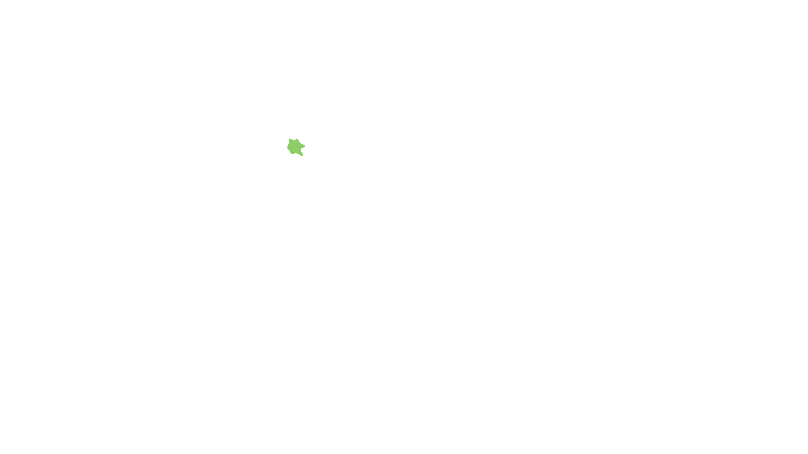
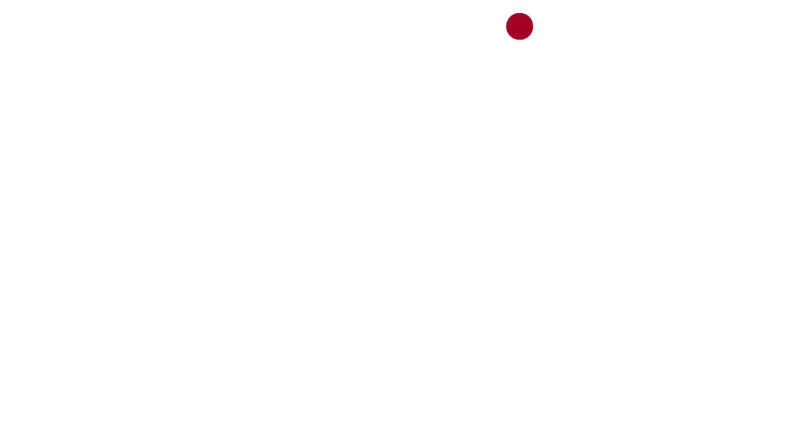
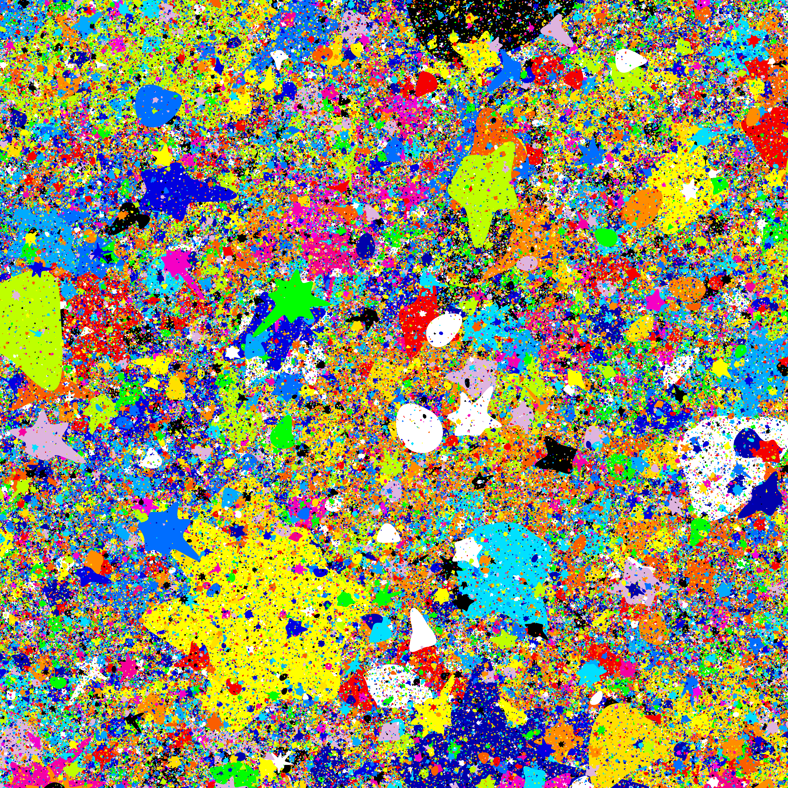
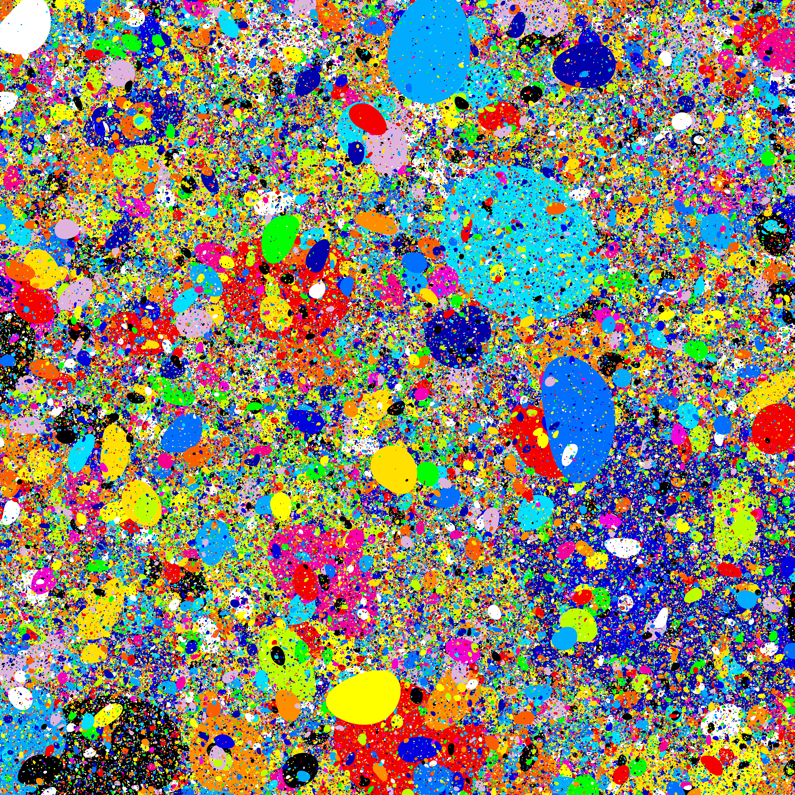
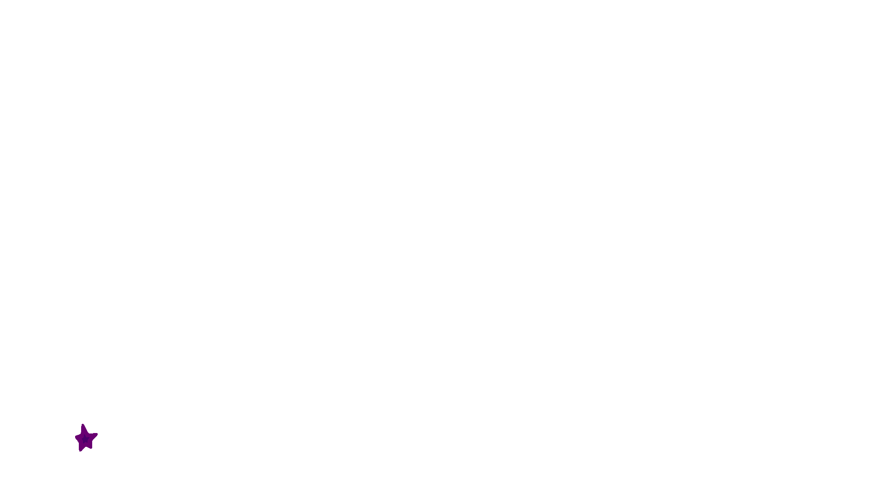
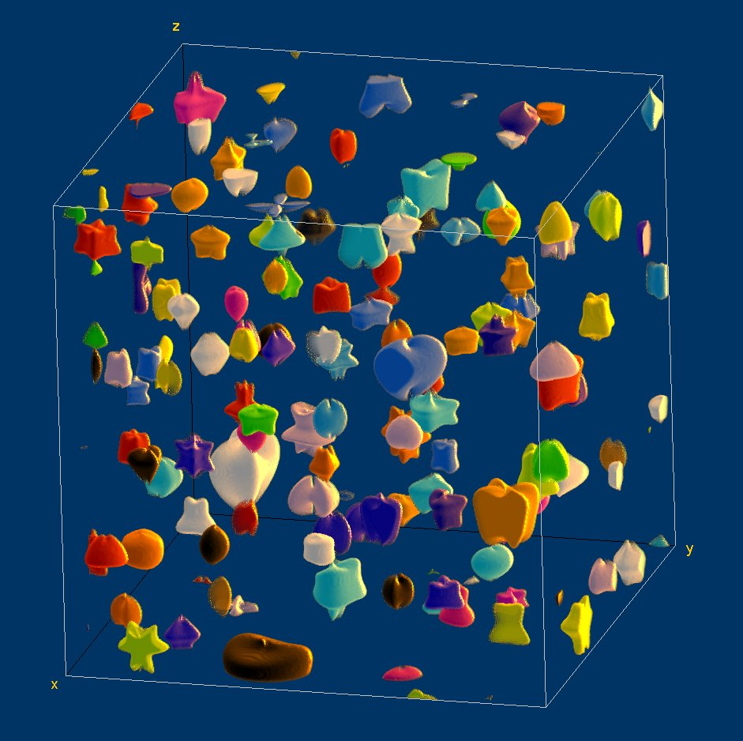
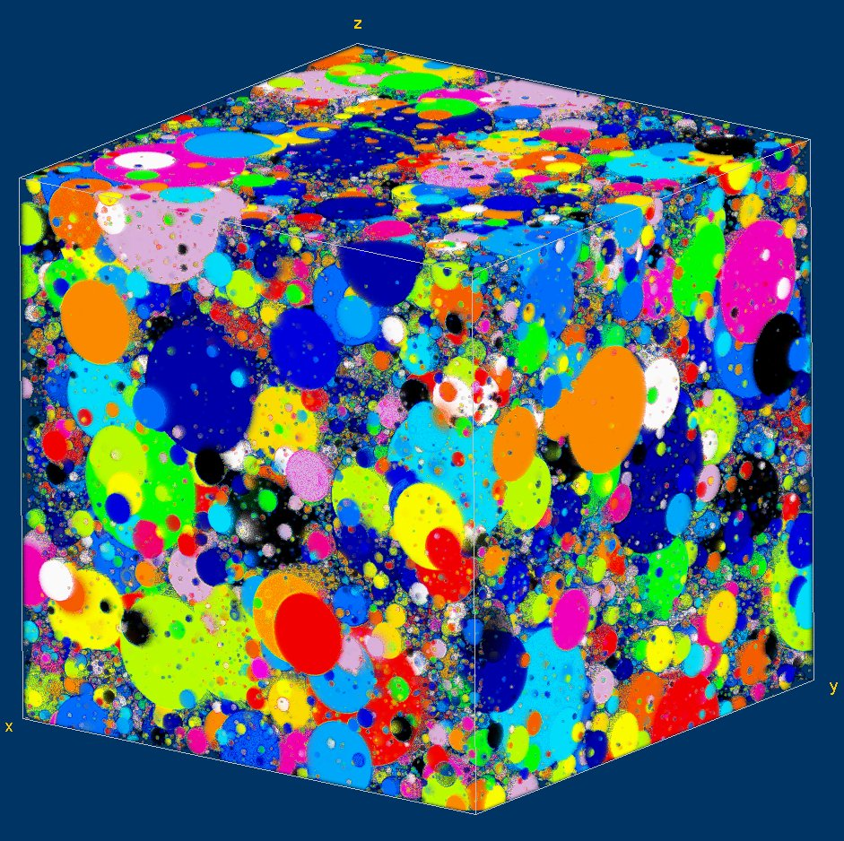
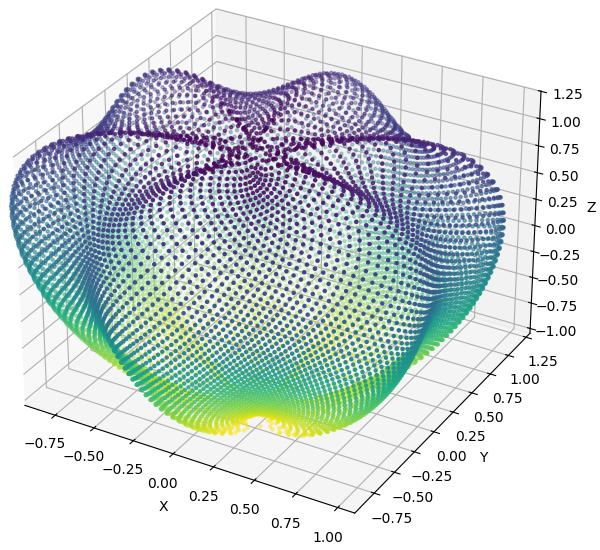

# Super Dead Leaves pattern generator

## Overview

The **Super Dead Leaves** (SDL) pattern is an open-source extension of the stochastic Dead Leaves pattern [1,2] used for the evaluation of texture reproduction fidelity in photography [3,4], and other applications.
Instead of using overalapping circles, the new SDL utilizes Johan Gielis' **superformula** [5] to generating complex shapes that better resemble overlapping leaves.
In addition, the formula parameters can be randomly sampled in each lobe of the shape for increased variability and asymmetry.
The random nature of the shapes is intended to enhance the utility of the pattern for image quality evaluation [6] and for training and testing machine learning-based image post-processing algorithms [7], posing a more substantial challenge than the predictable circular shapes.
  
A 3D version of the pattern, **Super Dead Leaves 3D** (SDL3D) is also provided toe generated 3D textured volumes, with potential applications in the development and evaluation of tomographic image reconstruction algorithms.

- [1] Cao, Frédéric, Frédéric Guichard, and Hervé Hornung. "Dead leaves model for measuring texture quality on a digital camera." In SPIE Digital Photography VI, vol. 7537, pp. 126-133 (2010) (<https://doi.org/10.1117/12.838902>)
- [2] Lee, A.B., Mumford, D. and Huang, J. "Occlusion Models for Natural Images: A Statistical Study of a Scale-Invariant Dead Leaves Model." International Journal of Computer Vision 41, pp. 35–59 (2001) (<https://doi.org/10.1023/A:1011109015675>)
- [3] IEEE 1858-2023 Standard for Camera Phone Image Quality (<https://standards.ieee.org/ieee/1858/6931/>)
- [4] ISO/TS 19567-2:2019, "Photography — Digital cameras, Part 2: Texture analysis using stochastic pattern" (2019)
- [5] Gielis, Johan. "A generic geometric transformation that unifies a wide range of natural and abstract shapes." American journal of botany 90, pp. 333-338 (2003) (<https://doi.org/10.3732/ajb.90.3.333>)
- [6] Artmann, Uwe. "Image quality assessment using the dead leaves target: experience with the latest approach and further investigations." In SPIE Digital Photography XI, vol. 9404, pp. 130-144 (2015) (<https://doi.org/10.1117/12.2079609>)
- [7] Achddou, Raphaël, Yann Gousseau, and Saïd Ladjal. "Fully synthetic training for image restoration tasks." Computer Vision and Image Understanding 233, 103723 (2023). (<https://doi.org/10.1016/j.cviu.2023.103723>)

## Code features

The functions to generate the 2D SDL patterns are encapsulated in the class named SuperDeadLeaves, in the file _SuperDeadLeaves.py_.
3D versions of the pattern can be generated with the functions in the file _SuperDeadLeaves3D.py_.

The stochastic procedural texture generation model allows creating unlimited patterns, with an unlimited resolution.
Many customizable parameters can be adjusted to vary the size and structure of the individual shapes and the general appearance of the final pattern. The provided Jupyter Notebooks show how the models can be used. Examples images generated with the software, and simplified animations showing the pattern construction, are shown below:


- _Super Dead Leaves_: the new Super Dead Leaves texture evalution chart with shapes generated by the randomized superformula. Simplified animation and full pattern.



- _Classic Dead Leaves_: the classic Dead Leaves texture evalution chart is a subset of the SDL that can be easily generated by the current algorithm by using the input parameters requesting circles (i.e., polygons with "0-edges"): polygon_range=[0,0].




- _Complete Super Dead Leaves patterns_: example Super Dead Leaves patterns filling the entire image, with the smallest shapes generated with the power-law distribution of the size of a pixel. Showing a pattern with a range of ploygonal shapes, and a pattern with deformed circles (polygon_range=[2,2]).




- _Digital cytology_: an example extension of SDL algorithm is included to generate a random distribution of isolated shapes that resemble cells (the spacing between the cells and the size of the inner nucleus can be customized).



- _Super Dead Leaves 3D_: extension of the new Super Dead Leaves texture to 3D, using two superformula profiles to generate each overlapping 3D shape. Volume rendering of a completely filled volume, and a volume with separated shapes to show the complexity of the objects (volume generated with the option "overlap_factor=2" in the "add_shape" function).



- _Dead Leaves 3D_: extension of the classic Dead Leaves texture to 3D, using the generator from SuperDeadLeaves3D with polygon_range=[0,0]. Any 2D cross-section of this volume is a valid Dead Leaves pattern.



- _3D uperformula shape_: example visualization of a random 3D shape generated by the two superformula profiles in spheric coordinates.




## Installation

To run the code, install the required Python packages and clone the repository:

```bash
git clone https://github.com/DIDSR/SuperDeadLeaves.git
cd SuperDeadLeaves/
pip install .
```

To run the code in other projects without cloning the repo, use `pip`:

```bash
pip install git+https://github.com/DIDSR/SuperDeadLeaves.git
```

### Run the example Jupyter Notebook

Open the `SuperDeadLeaves.ipynb` notebook in Jupyter to start generating 2D textures (`SuperDeadLeaves3D.ipynb` for 3D textures):

```bash
jupyter notebook SuperDeadLeaves.ipynb
```

## Disclaimer

This software and documentation (the "Software") were developed at the **US Food and Drug Administration** (FDA) by employees of the Federal Government in the course of their official duties. Pursuant to Title 17, Section 105 of the United States Code, this work is not subject to copyright protection and is in the public domain. Permission is hereby granted, free of charge, to any person obtaining a copy of the Software, to deal in the Software without restriction, including without limitation the rights to use, copy, modify, merge, publish, distribute, sublicense, or sell copies of the Software or derivatives, and to permit persons to whom the Software is furnished to do so. FDA assumes no responsibility whatsoever for use by other parties of the Software, its source code, documentation or compiled executables, and makes no guarantees, expressed or implied, about its quality, reliability, or any other characteristic. Further, use of this code in no way implies endorsement by the FDA or confers any advantage in regulatory decisions. Although this software can be redistributed and/or modified freely, we ask that any derivative works bear some notice that they are derived from it, and any modified versions bear some notice that they have been modified.
